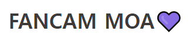
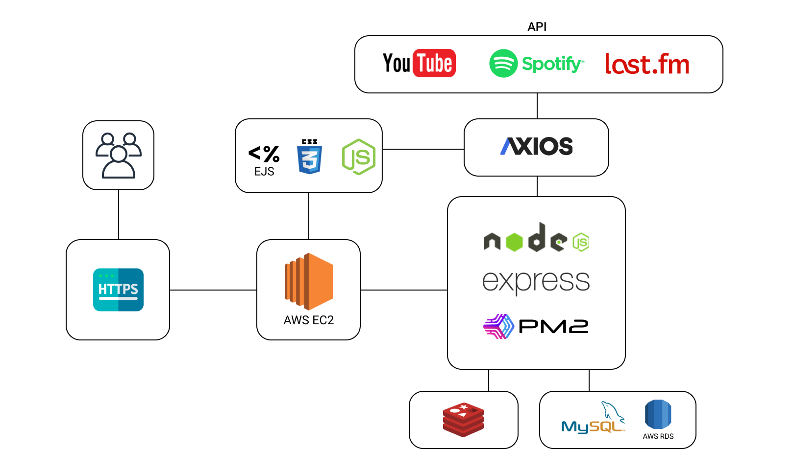

# ✨ K-POP 영상, 뉴스, 순위 콘텐츠를 제공합니다! ✨

사이트 대표사진, 사이트 설명글 넣기

<br>
<br>

## K-POP스타들의 영상을 검색하고 시청해 보세요!
평소에 좋아하던 K-POP스타를 검색해 보세요.
토글로 스샷1
토글로 스샷2
<br>

## K-POP스타들의 순위를 확인하세요!

<br>

## K-POP스타들의 최신 뉴스를 확인하세요!

<br>

## K-POP스타들의 영상을 모아보세요!
좋아요한 영상들을 모아서 볼 수 있습니다.
토글로 스샷1
<br>

## K-POP스타들의 영상을 모아보세요!
[💜 팬캠모아 사이트로 이동하기 💚](https://www.fancammoa.com/)  

<br>
<br>

## 📌 목차 

<br>
<br>

## 🎥 시연 영상

<br>
<br>

## 👨‍⚖️ 기술적 의사결정

<br>
<br>

## 🕵️‍♂️ 트러블슈팅

### ~~~

<br>

### ~~~

<br>

### ~~~

<br>

### ~~~

<br>
<br>

## ⚙️ 서비스 아키텍처



<div>
  <!-- Node.js -->
  
  <!-- Express -->
  
  <!-- PM2 -->
  
</div>

<div>
  <!-- EJS -->
  
  <!-- CSS -->
  
  <!-- JS -->
  
</div>

<div>
  <!-- AWS -->
  
  <!-- Axios -->
  
</div>

<div>
  <!-- Redis -->
  
  <!-- MySQL -->
  
  <!-- RDS -->
  
</div>

<br>
<br>

## 🗂 프로젝트 구조

<details>
  <summary><b>Back-End (Node.js)</b></summary>
  
```html
📦src
 ┣📂architecture                  
 ┣ ┣📂controllers
 ┣ ┣📂repositories
 ┣ ┗📂services
 ┣📂config                   
 ┣📂middlewares                  
 ┣📂models           
 ┣📂routes
 ┣📂seeders                 
 ┗📜app.js
📦views
 ┣📂static
 ┣ ┣📂css
 ┗ ┗📂js
```
</details>

<br>
<br>

## 🛠 설계

## 🌏 지원하는 브라우저

|  |  |  |
| :-: | :-: | :-: |
| Chrome | Edge | Safari |

<br>
<br>

## 👨‍🚀 제작자
