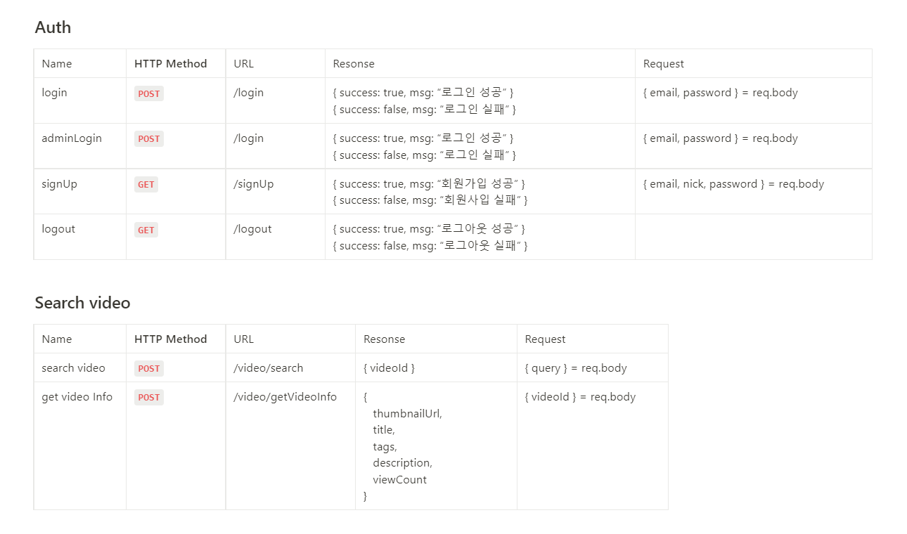

# ✨ K-POP 영상, 뉴스, 순위 콘텐츠를 제공합니다! ✨
[](https://www.fancammoa.com/)  
이미지를 클릭하면 사이트로 이동 합니다.  
<a href="https://www.fancammoa.com/" target="_blank" style="font-size: 25px;">fancammoa.com</a>

<br>

K-POP 아이돌 팬들을 위한 사이트   
각 아이돌의 직캠, 뮤직비디오, 인터뷰 등을 검색하고 소장해 보세요.  
그리고, 최신 K-POP 뉴스와 순위를 확인하실수 있습니다.  

<br>

## 기술적 의사결정

<br>
<br>

## 기능구현

<br>
  - 회원가입, 로그인, 유효성 검사  
      - express-session, passport, joi를 통한 구현  
      - joi 유효성검사: 서버에서 유효성 검사를 간결, 정확하게 수행하고, 서버에 전달되는 데이터의 정확성과 일관성을 보장하기 위해 사용  
<br>
  - 아이돌 영상검색 및 시청  
      - 유튜브 API를 이용하여 검색로직 구하였고 키워드를 통해 K-POP과 상관없는 검색결과를 걸러낼수있도록 구현  
<br>
  - K-POP 순위보기  
      - Spotify API, Last FM API, 유튜브API 등을 활용하여 저장된 K-POP 가수들의 각종 수치들을 이용해 순위를 산정  
<br>
  - K-POP 뉴스보기  
      - 웹 페이지의 동적 로딩 등에 대응하기 위해 Selenium을 이용하여 뉴스픽 사이트 크롤링을 하여 구현  
      - Server side 페이지네이션:  뉴스데이터는 자주 업데이트 되므로  offset이 아니라 cursor페이지네이션을 id순서 기반으로 구현  
<br>
  - 마이페이지  
      - 유저와 영상을 N:M 관계 설정을 통해 CRUD를 적용하여 영상 좋아요 기능을 구현 하였고, 좋아요한 영상들을 모아 볼 수 있습니다.  
<br>
  - 어드민 페이지  
      - 등록된 관리자 아이디만 들어갈수있도록 미들웨어에서 막아주었으며, 관리자 로그인을 해야 버튼이 나오도록 구현  
      - 아이돌 정보, 점수 업데이트: Spotify API, 유튜브 API등을 호출하여 전체, 개인별 점수 업데이트를 할 수 있으며, 아이돌을 CRUD 할 수 있도록 구현  
      - 아이돌 순위 이미지 업데이트: 아이돌 순위 이미지를 CRUD를 통해 업데이트 할 수 있도록 구현  
      - K-POP뉴스 업데이트: Selenium을 이용하여 뉴스픽 사이트 크롤링을 하여 업데이트 할 수 있으며, CRUD를 통해 업데이트  
      - 키워드 업데이트:  CRUD를 통해 업데이트 할 수 있도록 구현  
        
<br>
<br>

## 트러블슈팅

<details>
  <summary>아이돌 영상검색 및 시청</summary>
  <div markdown="1">

  - 검색결과 문제:   
    K-POP과 상관없는 검색결과, 유저의 목적과 다른 검색 결과가 같이 검색되는 문제가 발생하였고, 검색결과 영상의 tag, title, description과 db에 저장되어있는 키워드들을 비교하여 키워드와 맞지 않으면 검색결과를 보여주지 않게 하였습니다.

  - APIKEY노출 문제:   
    유튜브 API KEY 노출등 보안적 이슈로인해 프론트엔드에 있던 검색로직을 백엔드쪽으로 옮겨 로직을 보이지 않게하였으며 .env를 활용하여 API KEY보안 강화하였습니다.

  - 유튜브 API 할당량 문제:  
    유튜브 API 할당량 소모시 검색 로직을 사용하지 못하는 상황이 발생 하였고, 매번 유튜브API 조회를 하지 않기 위해 redis 캐싱작업으로 유튜브API조회 최소화하였습니다.

  </div>
</details>

<br>

<details>
  <summary>배포환경 에러</summary>
  <div markdown="1">

  - 뉴스페이지 크롤링   
    배포환경 Selenium 크롬 크롤링 실행이 되지 않는 이슈를 Linux 에서 chromedriver, xvfb 설치를 통해 해결
    
  - CORS 해결   
    CORS 미들웨어 함수를 app.js 미들웨어 가장 상단에 두어 클라이언트와 서버 간의 자유로운 데이터 교환을 가능하게 변경
    
  - RDS MySql error “is blocked because of many connection errors. Unblock with 'mysqladmin flush-hosts” 에러   
    RDS 파라미터 그룹에서 max_connect_errors 값을 수정후 해결

  </div>
</details>

<br>
<br>

## 서비스 아키텍처


<div>
  <!-- Node.js -->
  
  <!-- Express -->
  
  <!-- PM2 -->
  
</div>

<div>
  <!-- EJS -->
  
  <!-- CSS -->
  
  <!-- JS -->
  
</div>

<div>
  <!-- AWS -->
  
  <!-- Axios -->
  
</div>

<div>
  <!-- Redis -->
  
  <!-- MySQL -->
  
  <!-- RDS -->
  
</div>

<br>
<br>

## 프로젝트 구조

  <summary><b>Back-End (Node.js)</b></summary>
  
```html
📦src
 ┣📂architecture                  
 ┣ ┣📂controllers
 ┣ ┣📂repositories
 ┣ ┗📂services
 ┣📂config                   
 ┣📂middlewares                  
 ┣📂models           
 ┣📂routes
 ┣📂seeders                 
 ┗📜app.js
📦views
 ┣📂static
 ┣ ┣📂css
 ┣ ┗📂js
 ┣📜...
```

<br>
<br>

## ERD 설계

<br>


<br>
<br>

## API 설계

<br>


<details>
  <summary>API 설계 더 보러가기</summary>
  <div markdown="1">

  <a href="https://www.notion.so/API-cb924349c9ec450384a894e9f456fe14?pvs=4" target="_blank" style="font-size: 25px;">Notion/FancamMoa API</a>

  </div>
</details>

<br>
<br>

## 👨‍🚀 제작자

<br>

| Name: 정성훈 | GitHub: [github.com/poodly](https://github.com/Poodly) | Email: qwe0238@naver.com |
