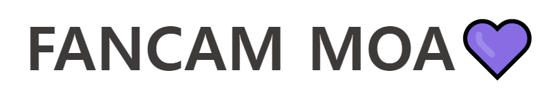

# ✨ K-POP 영상, 뉴스, 순위 콘텐츠를 제공합니다! ✨
[](https://www.fancammoa.com/)  

<br>

K-POP 아이돌 팬들을 위한 사이트   
각 아이돌의 직캠, 뮤직비디오, 인터뷰 등을 검색하고 소장해 보세요.  
그리고, 최신 K-POP 뉴스와 순위를 확인하실수 있습니다.  

<br>

## K-POP스타들의 영상을 검색하고 시청해 보세요!
<details>
  <summary>K-POP스타를 검색하고 시청</summary>
  
  
</details>

<br>

## K-POP스타들의 순위를 확인하세요!
<details>
  <summary>K-POP스타의 순위</summary>
  
  
</details>

<br>

## K-POP스타들의 최신 뉴스를 확인하세요!
<details>
  <summary>K-POP스타의 뉴스</summary>
  
</details>

<br>

## K-POP스타들의 영상을 모아보세요!
<details>
  <summary>영상들을 좋아요하여 마이페이지에 모아보세요.</summary>
  
  
</details>
<br>

## 💚 팬캠모아 사이트로 이동하기 💚
<a href="https://www.fancammoa.com/" target="_blank" style="font-size: 25px;">fancammoa.com</a>

<br>
<br>

## 📌 목차 

<br>
<br>

## 🎥 시연 영상

<br>
<br>

## 👨‍⚖️ 기술적 의사결정

<br>
<br>

## 🕵️‍♂️ 트러블슈팅

### ~~~

<br>

### ~~~

<br>

### ~~~

<br>

### ~~~

<br>
<br>

## ⚙️ 서비스 아키텍처


<div>
  <!-- Node.js -->
  
  <!-- Express -->
  
  <!-- PM2 -->
  
</div>

<div>
  <!-- EJS -->
  
  <!-- CSS -->
  
  <!-- JS -->
  
</div>

<div>
  <!-- AWS -->
  
  <!-- Axios -->
  
</div>

<div>
  <!-- Redis -->
  
  <!-- MySQL -->
  
  <!-- RDS -->
  
</div>

<br>
<br>

## 🗂 프로젝트 구조

  <summary><b>Back-End (Node.js)</b></summary>
  
```html
📦src
 ┣📂architecture                  
 ┣ ┣📂controllers
 ┣ ┣📂repositories
 ┣ ┗📂services
 ┣📂config                   
 ┣📂middlewares                  
 ┣📂models           
 ┣📂routes
 ┣📂seeders                 
 ┗📜app.js
📦views
 ┣📂static
 ┣ ┣📂css
 ┣ ┗📂js
 ┣📜...
```

<br>
<br>

## 🛠 설계

<details>
  <summary><b>ERD</b></summary>
  <div markdown="1">
    <ul>
      <div></div>
    </ul>
  </div>
</details>

<details>
  <summary><b>API</b></summary>
  <div markdown="1">
    <ul>
      API
    </ul>
  </div>
</details>

<br>
<br>

## 👨‍🚀 제작자

<br>

| 정성훈 |  
| GitHub | https://github.com/poodly |  
| Email  | qwe0238@naver.com |
